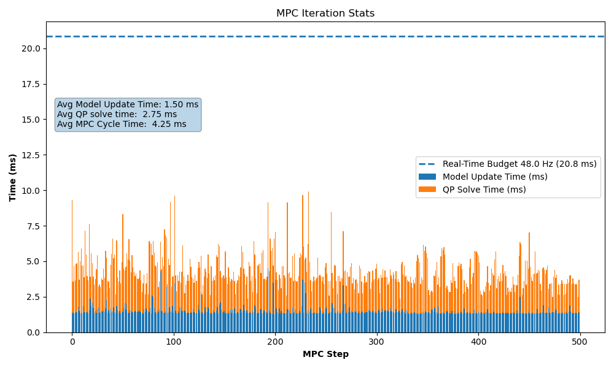
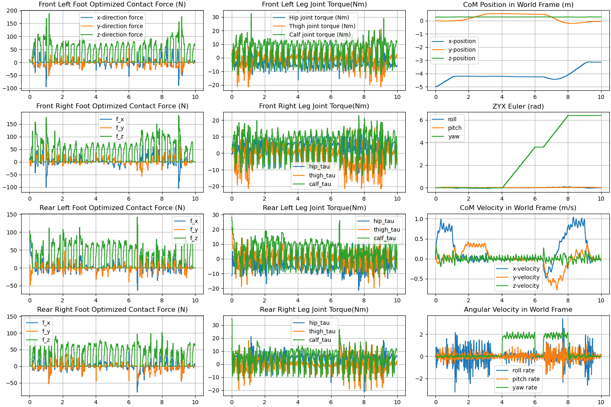

# MPC Locomotion Control of the Unitree Go2 Quadruped Robot in MuJoCo
This repository implements a **Convex Model Predictive Controller (MPC)** for the Unitree Go2 quadruped robot, including contact-force optimization, centroidal linearized dynamics, Raibert-style foot planning, swing-leg path generation and MuJoCo simulation.

Developed as part of the **UC Berkeley Master of Engineering (MEng)** capstone project in Mechanical Engineering.

> **Under development:** A C++ implementation targeting real-time performance is in progress. See the **Updates** section below for the latest status.

## Introduction

The controller is designed following the methodology described in the following publication:

> **"Dynamic Locomotion in the MIT Cheetah 3 Through Convex Model-Predictive Control"**  
> https://dspace.mit.edu/bitstream/handle/1721.1/138000/convex_mpc_2fix.pdf

The objective of this project is to reproduce the main ideas presented in the paper — particularly the **contact-force MPC formulation**, convex optimization structure, and robust locomotion behavior—while integrating them into a modern, modular robotics control pipeline.

## Locomotion Capabilities

The controller achieves the following performance in MuJoCo simulation:

### Linear Motion
- **Forward speed:** up to **0.8 m/s**
- **Backward speed:** up to **0.8 m/s**
- **Lateral (sideways) speed:** up to **0.4 m/s**
<p align="center">
  
  <br/>
  <sub><b>examples/ex02</b>: Forward walking &nbsp;&nbsp; <b>examples/ex03</b>: Side walking</sub>
</p>

### Rotational Motion
- **Yaw rotational speed:** up to **4.0 rad/s**

<p align="center">
  <br/>
  <sub><b>examples/ex04</b>: Trot rotation</sub>
</p>


### Supported Gaits
- Trot gait (tested at 3.0 Hz with 0.6 duty cycle)

## Controller Overview

Our motion control stack includes:

- **Centroidal MPC (~30-50 Hz)**  
Contact-force–based MPC implemented via **CasADi** using OSQP, solving a convex QP each cycle. The prediction horizon spans one full gait cycle, divided into 16 time steps.

- **Reference Trajectory Generator (~30-50 Hz)**  
Generates centroidal trajectory for MPC based on user input.

- **Swing/Stance Leg Controller (200 Hz)**  
    - Swing-phase: impedance control with foot trajectory and force tracking
    - Stance-phase: joint torque computation to realize MPC contact forces

- **Gait Scheduler and Foot Trajectory Generator (200 Hz)**  
    - Determines stance/swing timing
    - Compute touchdown position for swing-foot using Raibert style foot placement method and - - Compute swing-leg trajectory using minimal jerk quintic polynomial with adjustable apex height

## Libraries Used

### Physics Simulation
- **MuJoCo** — https://github.com/google-deepmind/mujoco

### Kinematics and Dynamics
- **Pinocchio** — https://github.com/stack-of-tasks/pinocchio

## Installation and Dependencies
Linux is recommended, other OS not tested.
### 1. Clone the repository
```bash
git clone https://github.com/elijah-waichong-chan/go2-convex-mpc.git
cd go2-convex-mpc
```

### 2. Create a Conda environment
```bash
conda env create -f environment.yml
conda activate go2-convex-mpc
```

If you see import errors (e.g., ModuleNotFoundError: convex_mpc) rerun:
```bash
pip install -e .
```

### 3. Quick check
Recommended on Linux if you have pip --user packages installed:
```bash
export PYTHONNOUSERSITE=1
```
Run import check:

```bash
python - <<'PY'
import mujoco, pinocchio, casadi, convex_mpc
print("mujoco:", mujoco.__version__)
print("pinocchio:", pinocchio.__version__)
print("casadi:", casadi.__version__)
print("convex_mpc: OK")
PY
```

## Run Examples
Run any demo from the repo root:
```bash
python -m examples.ex00_demo
python -m examples.ex01_trot_in_place
python -m examples.ex02_trot_forward
python -m examples.ex03_trot_sideway
python -m examples.ex04_trot_rotation
```

### Plots
After running each example script, summary plots will be generated

The figures below are generated from running **`examples/ex00_demo.py`**:
#### MPC Runtime Performance
<p align="center"> <br/> <sub> <b>MPC iteration timing.</b> Average model update time ≈ 1.50 ms, average QP solve time ≈ 2.75 ms, total MPC cycle time ≈ 4.25 ms, running comfortably within a 48 Hz real-time budget (20.8 ms). </sub> </p>

#### MPC State, Force, and Torque Logs
<p align="center"> <br/> <sub> <b>Centroidal MPC logs.</b> Optimized ground reaction forces for all four feet, joint torques, center-of-mass position and velocity, ZYX Euler angles, and body angular velocities during a command-scheduled locomotion sequence. </sub> </p>

## Updates

12/24/2025
- Added URDF and MJCF model to the repo.
- Simplified installation steps — no longer need to download URDF models and the `unitree_mujoco` library.
- Restructured the repo into a proper Python package
- Added `pyproject.toml` so the project can be installed
- Added a Conda `environment.yml` to automate dependency setup
- Added `examples/` demos


12/21/2025
- Reduced the overall controller loop from 1000 Hz → 200 Hz in preparation for real-time deployment; no observed performance degradation.
- The MPC update rate remains ~30–50 Hz, depending on gait frequency.

11/28/2025:
- Significantly faster model update and solving time per MPC iteration. Better matrix construction, implemented warm start, reduced redundant matrix update.
- Updated solve time plot style
- Updated motion demo in testMPC.py

11/26/2025:
- The controller is capable of full 2D motion and yaw rotation.
- The QP solve time for each MPC iteration are currently not capable of real-time control yet. This will be address in future updates with restructuring of the QP and more efficient matrix update.
- To adjust the cost matrix, go to centroidal_mpc.py
- To adjust the gait frequency and duty cycle, go to test_MPC.py
- To adjust the friction coefficient, go to centroidal_mpc.py, remember to change MuJoCo setting too.
- To adjust swing leg trajectory height, go to gait.py
- To adjust gait(phase offset), go to gait.py
- To adjust the desired motion, go to Trajectory Reference Setting in test_MPC.py
- To run the simulation and see the plotted results, run test_MPC.py
